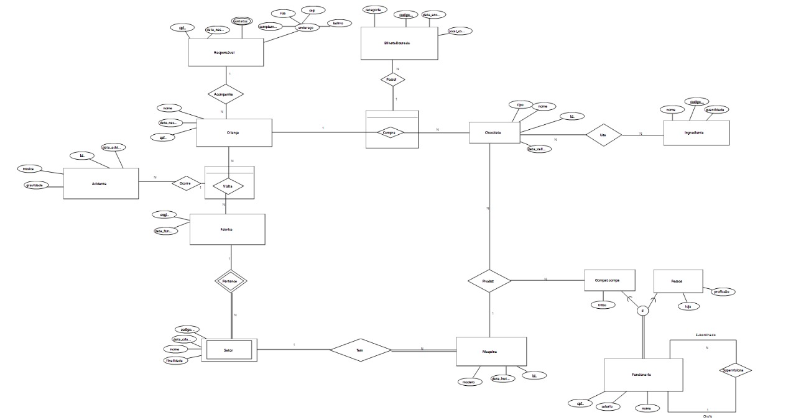

# 🍫 Sistema Fábrica de Chocolate

Sistema de banco de dados inspirado em **"A Fantástica Fábrica de Chocolate"** para gerenciar uma fábrica de doces com OompaLoompas, visitantes, produtos e acidentes.

## 🗂️ Estrutura do Projeto

### Arquivos Principais

- **`script_tabelas.sql`** - Script SQL original (Oracle) com definições das tabelas
- **`create_table.py`** - Script Python para criar todas as tabelas em SQLite
- **`insert_data.py`** - Script para inserir dados de exemplo para teste
- **`consultas_menu.py`** - Sistema completo de consultas com menu interativo
- **`README.md`** - Documentação

### 🗄️ Banco de Dados

- **`fabrica_chocolate.db`** - Banco SQLite criado automaticamente a partir de `create_table.py`

## 🎯 Como Usar o Sistema

1. **Criar as tabelas:**
   ```bash
   python create_table.py
   ```

2. **Inserir dados:**
   ```bash
   python insert_data.py
   ```

3. **Consultar dados:**
   ```bash
   python consultas_menu.py
   ```

## 📊 Estrutura do Banco de Dados



### Entidades Principais

1. **Responsavel** - Responsáveis pelas crianças
2. **Fabrica** - Dados da fábrica de chocolate
3. **Ingrediente** - Ingredientes usados na produção
4. **Produto** - Produtos fabricados
5. **Funcionario** - Funcionários da fábrica
6. **Criança** - Crianças que visitam a fábrica
7. **Setor** - Setores da fábrica
8. **Maquina** - Máquinas de produção

### Hierarquias de Herança

- **Funcionario**
  - OompaLoompa (com tribo)
  - Pessoa (funcionários humanos)

- **Produto**
  - Chocolate (com tipo, recheio, criança associada)
  - Chiclete

### Relacionamentos

- **Visita** - Crianças visitam a fábrica
- **Acidente** - Acidentes durante visitas
- **PRODUZ** - Funcionários produzem produtos
- **USA** - Produtos usam ingredientes
- **BilheteDourado** - Bilhetes dourados em chocolates

## 🛠️ Tecnologias Utilizadas

- **SQLite** - Banco de dados
- **Python 3** - Linguagem de programação
- **sqlite3** - Módulo Python para SQLite

## 📝 Consultas implementadas

1. **LEFT JOIN** - Crianças que não compraram chocolates.
2. **INNER JOIN** - Produtos e seus ingredientes.
3. **UNION** - Todos os CPFs cadastrados no sistema.
4. **SEMI-JOIN** - Crianças que sofreram acidentes.
5. **ANTI-JOIN** - Chocolates sem bilhete dourado.
6. **GROUP BY HAVING** - Tribos com múltiplos OompaLoompas.
7. **Subconsulta Escalar** - Contagem de ingredientes por produto.
8. **Subconsulta de Linha** - Produtos com mesmo preço e validade.
9. **Subconsulta de Tabela** - Produtos que utilizam Avelã como ingrediente.

## 🤝 Como Contribuir

1. Clone o repositório
2. Crie suas modificações
3. Teste com os scripts de consulta
4. Documente as mudanças